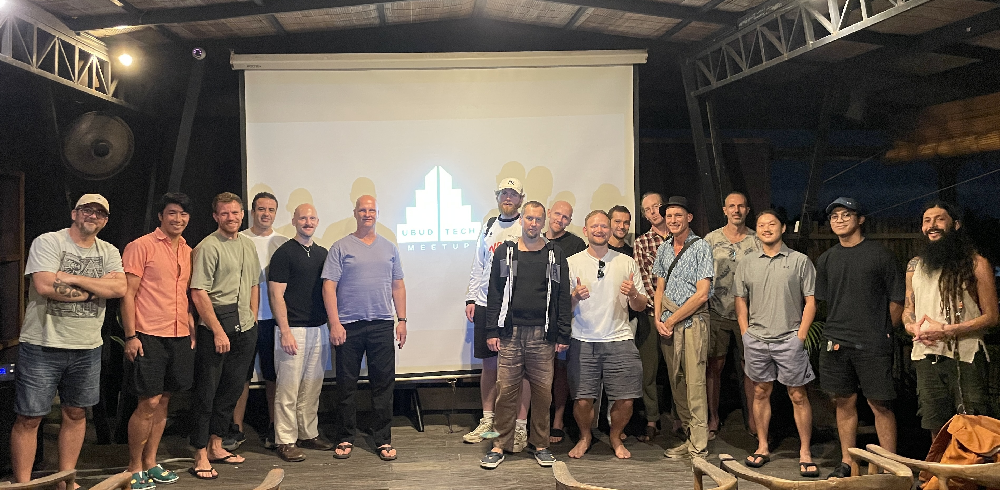

# Ubud Tech Meetup: Building Kula

Ubud Tech Meetup's 4th meetup!
​ In this meetup, we have one of our members, Chetan, share his journey of building Kula (heykula.ai), a people-matching platform that uses voice Al and WhatsApp to connect community members.

​He'll explore the product experience, the architecture behind it, and practical lessons learned shipping Al systems in the real world.

Slides: https://heykula.ai/deck

---

## When
6:30pm - 8:30pm, Tuesday, May 26, 2026

## Where
[Outpost Ubud Penestanan](https://maps.app.goo.gl/ygAdL4VDhwpKkixF7)  
Jl. Penestanan, Sayan, Kecamatan Ubud, Kabupaten Gianyar, Bali 80571

_A HUGE THANKS to [Outpost](https://destinationoutpost.co/location/ubud-penestanan/) for providing the venue space!_

## Cost
Free (as in beer) 

---

Last meetup's turn out was great! It was our first time hosting at Outpost Ubud Penestanan, and we had over 20 attendees.

 

If this is your first time here, Welcome to Ubud Tech Meetup. We exist to share and educate community members, consisting of devs, UX designers, and tech enthusiasts in Ubud, Bali. We meet on last Tuesdays of every month.

