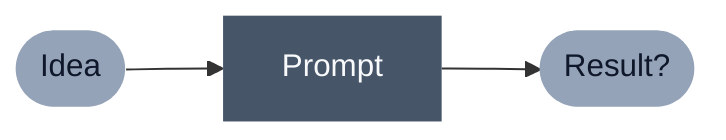
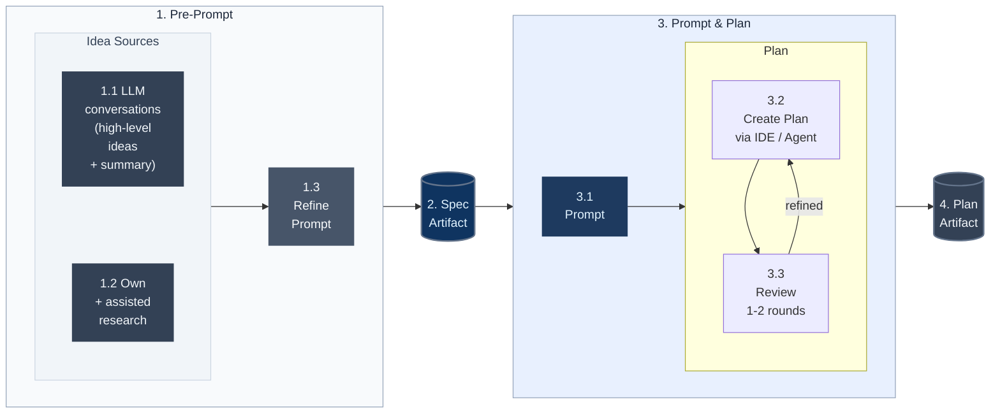

  <Timer title="Networking" />

<Logo />

## _Welcome to our 2nd meetup!_
|     |                        |
|----:|:-----------------------|
|6:00 | Networking + Food      |
|6:45 | About Ubud Tech Meetup |
|7:00 | Tech Talk              |
|7:30 | Networking             |

  <i>— Sponsored by Nhost —</i>

---
layout: cover
---

## Thanks to our sponsor Nhost 🍕

### https://nhost.io

---
src: ../about-meetup.md#2-5
---

---
class: px-20
layout: center
title: Now for the main talk
---

<h2 color="gray" italic>And now to for main talk...</h2>

---
layout: cover
background: https://cdn.jsdelivr.net/gh/slidevjs/slidev-covers@main/static/ahX1sknMGhg.webp 
title: "Tech Talk: Vibe Engineering"
---

<h1>Vibe Engineering</h1>
<h2>Beyond Vibe Coding</h2>

 

  Paul Yun — April 28, 2026

---
layout: two-cols
title: About Me
---

<h2 class="ml-17">Hi, I'm Paul Yun.</h2>  
 

::right::

   

- Software Engineer for 10 years at Wayfair, Almanac, Kaiber
- Taught at UCLA, edX Bootcamps, Nucamp
- From Philadelphia + I love skateboarding 🛹

  
<SocialHandle type="linkedin" url="linkedin.com/in/yunpaul" />
<SocialHandle type="github" url="github.com/PVUL" />

---
layout: center
transition: fade-out
---

# Goal of this talk

## _Shift your approach on vibe coding projects_

---
layout: center
transition: fade-out
---

# Why?

  Because with an engineering mindset:

  
  - You can build more complex projects

  - Systematize your process

---
layout: center
---

## So how can we start **_engineering_**?

---

# Mental Model Shift

  <!-- Before Section -->
  

    

      Traditional   + Vibe Coding
    

    

      

        Planning
      

      

        Implementation
      

      

        Review
      

    

  

  <!-- After Section -->
  

    

      Vibe   Engineering
    

    

      

        Planning
      

      

        Implementation
      

      

        Review
      

    

  

---
layout: center
---

_The approach._

## "Measure twice, cut once"

  

---
layout: two-cols
---

# I. Workflow

= 2 }">
  <ul>
    <li class="bright">1. Plan
      <ul>
        <li class="bright">1.1 Clarify the spec</li>
        <li class="bright">1.2 Create plan</li>
      </ul>
    </li>
  </ul>
   
  <ul>
    <li class="dim">2. Implement
      <ul>
        <li class="dim">2.1 Implementation tasks</li>
        <li class="dim">2.2 Debug</li>
      </ul>
    </li>
  </ul>
   
  <ul>
    <li class="dim">3. Review
      <ul>
        <li class="dim">3.1 Test</li>
        <li class="dim">3.2 Document</li>
      </ul>
    </li>
  </ul>

<!-- Registers click 2 with Slidev's counter without showing/hiding anything -->

::right::

  <h1>II. Process Improvement</h1>
  
= 2 }">
    <ul>
      <li class="dim">A. Artifact Curation
        <ul class="ml-5">
          <li class="dim">A.1 Specs, Docs, Opportunities, Decisions, etc.</li>
        </ul>
      </li>
       
      <li class="bright">B. Agentic Skills
        <ul class="ml-5">
          <li class="bright">B.1 Workflow Optimization</li>
          <li class="bright">B.2 Consistent Opportunities Discovery</li>
        </ul>
      </li>
    </ul>
  

---

# Workflow: Plan

  

  
The hope: one prompt, done.

  

  

  
The improved workflow: sources → spec → plan → review.

  

---
layout: center
---

# Process Improvement: Agentic Skills

  

    <h3 class="text-primary mb-4 uppercase tracking-widest text-sm font-bold">What?</h3>
    

      <b>Agents with power tools.</b> Reusable, versioned instructions (e.g., <code>SKILL.md</code>) that define specific agent behaviors. 
    

    

      Moving from <i>ephemeral prompts</i> to <i>modular systems</i>.
    

  

  

    <h3 class="text-primary mb-4 uppercase tracking-widest text-sm font-bold">Why?</h3>
    <ul class="space-y-4 list-none p-0">
      <li class="flex items-start gap-3">
        

        
<b>Consistency:</b> Enforce engineering rigor by default.

      </li>
      <li class="flex items-start gap-3">
        

        
<b>Scaling:</b> Automate complex architectural reviews.

      </li>
      <li class="flex items-start gap-3">
        

        
<b>Evolution:</b> Your process improves as your skills repo grows.

      </li>
    </ul>
  

  
Skill Examples:

  

    

      
SKILL.md

      
clarify-specs

      
Stress-test a plan via relentless questioning until shared understanding.

    

    

      
SKILL.md

      
improve-codebase-architecture

      
Surface refactor opportunities, guided by ADRs and domain context.

    

    

      
SKILL.md

      
caveman

      
Ultra-compressed comms — cuts token usage ~75% while keeping accuracy.

    

  

---

# My project: `Aspire.You`
 

#### _Aspire.You_ is a community platform for user-focused personal growth

---
layout: cover
---

# Demo time

and the opportunities I discovered using: 
  
- agentic skills
 
- artifacts
 
- agent skills updates

---

# Result

Using the engineering approach:

- Can build complex architectures, allowing me to focus on product
- Still not perfect, but I wrestle with AI less now

 

_Next implementations:_

- Zustand (manage UI state) and DrizzleORM (type-safe queries)
- Testing Strategy
- Cloudflare Workers + Durable Objects (sync layer)

---
layout: center
---

_Takeaways._
<h2>1. Clarify specs for planning</h2> 
<h2>2. Think in systems for process improvement</h2>

  

---
layout: center
class: text-center
title: closing
---

## “Perfection is achieved, 
## not when there is nothing more to add, 
## but when there is **_nothing left_** to take away.” 
Antoine de Saint-Exupéry

---
layout: center
---

#### Thank you.

 

## Questions?

 

---
src: ../about-meetup.md#1 # Logo
---